# Lab4 single cycle cpu 1 & 2 & 3

## 操作方法和实验步骤

### 项目结构

```shell
.
├── doc
│   └── report.md
├── sources
│   ├── cpu
│   │   ├── SCPU.sv
│   │   ├── datapath
│   │   │   ├── my_ALU.sv
│   │   │   ├── my_PC.sv
│   │   │   ├── my_Regs.sv
│   │   │   └── my_immgen.sv
│   │   ├── ip
│   │   │   └── instruction_memory
│   │   ├── mem_handler.sv
│   │   ├── my_cpu_control.sv
│   │   └── my_datapath.sv
│   ├── includes
│   │   ├── cpu_control_signals.sv
│   │   ├── debug.vh
│   │   ├── header.sv
│   │   └── vga_macro.vh
│   └── soc
│       ├── ip
│       │   └── data_memory.xci
│       ├── my_data_memory.sv
│       ├── soc.sv
│       └── soc_simulation.sv
└── tests
    ├── 1_datapath.S
    ├── 1_datapath_Imem.coe
    ├── 1_datapath_dmem.coe
    ├── 2_more.S
    ├── 2_more_Imem.coe
    ├── 3_auipc.S
    ├── 3_auipc_Imem.coe
    ├── 4_int.S
    └── 4_int_Imem.coe
```

### 源代码分析

大致是`soc_simulation.sv`实例化了`SCPU`模块，`SCPU`模块实例化了`my_datapath`模块，`my_datapath`模块实例化了`my_PC`、`my_Regs`、`my_ALU`、`my_immgen`模块。

Datapath 和 Control 交流的信号定义为interface，在`includes/cpu_control_signals.sv`中定义。

简单介绍一下代码中一些自己想到的地方

- 常量定义在`header.sv`中，这样方便修改
- 整个项目迁移到 SystemVerilog，使用了一些 SystemVerilog 的特性，比如 interface
- 实现了额外的lui, auipc指令
- 实现了对<32bit的内存读写的支持。这部分通过`mem_handler.sv`实现，该模块提供了截取和扩展32bit数据的功能

然后简单过一下这几天~~坐牢~~制造CPU的结果吧。

首先是顶层模块，`soc_simulation.sv`，通过使用`data_memory_face`接口，简化了代码。代码量不多就直接贴出来了。

```verilog
module soc_simulation(
    input wire clk,
    input wire rst
);
    wire [31:0] instruction;
    wire [31:0] program_counter;
    
    data_memory_face mem_if();

    SCPU uut (
        .clk(clk),
        .rst(rst),

        .inst_in(instruction),
        .PC_out(program_counter),
        
        .mem_if(mem_if.cpu)
    );

    instruction_memory U2(
        .a(program_counter[11:2]),
        .spo(instruction)
    );

    my_data_memory U3 (
        .clk(clk),
        .mem_if(mem_if.mem)
    );
endmodule


module soc_simulation_tb;
    reg clk;
    reg rst;

    soc_simulation m0(.clk(clk), .rst(rst));

    initial begin
        clk = 1'b0;
        rst = 1'b1;
        #5;
        rst = 1'b0;
    end

    always #50 clk = ~clk;
endmodule
```

然后是`SCPU`模块，这个模块实例化了`my_datapath`模块和`my_cpu_control`模块和`mem_handler`模块。`mem_handler`这个模块基本上就是夹在`my_datapath`和 Data memory 中间，把内存喂过来的32bit数据处理成需要的宽度和，处理datapath计算的地址，处理datapath想写入的内容。它是为了实现`lb`,`lbu`, `lh`, `lhu`, `sb`, `sh`指令引入的。这个模块的逻辑还是比较绕，有优化空间。也许它适合呆在`my_datapath`里面？

```verilog
module SCPU(
    input wire clk,          // Clock signal
    input wire rst,          // Reset signal

    input wire [31:0] inst_in, // Instruction input
    output wire [31:0] PC_out,   // Program counter output

    data_memory_face.cpu mem_if,

    `RegFile_Regs_output
);

    // Control signals interface
    cpu_control_signals signals_if();

    // Memory signals
    logic MemRW;
    logic [2:0] RWType;
    wire [31:0] Addr_out;      // Address output to memory
    wire [31:0] Data_out_raw;  // Data output to memory
    logic [31:0] Data_in;      // Data input from memory

    // Instantiate the control unit
    my_cpu_control control_unit (
        // from instruction
        .OPcode(inst_in[6:2]), // Opcode from instruction
        .Fun3(inst_in[14:12]), // Funct3 from instruction
        .Fun7(inst_in[30]),    // Funct7 from instruction
        
        // signals to datapath
        .signals_if(signals_if.control_unit),

        // Memory signals
        .MemRW(MemRW),         // Memory read/write signal
        .RWType(RWType)        // Read/write type signal
    );

    // Instantiate the data path
    my_datapath data_path (
        .clk(clk),             // Clock signal
        .rst(rst),             // Reset signal
        
        .signals_if(signals_if.datapath),
        
        .inst_field(inst_in),  // Instruction input
        .PC_out(PC_out),       // Program counter output

        .Addr_out(Addr_out),   // Address output to memory
        .Data_out(Data_out_raw),   // Data output to memory
        .Data_in(Data_in),     // Data input from memory

        `RegFile_Regs_Arguments
    );

    mem_handler mem_handler_inst (
        .MemRW(MemRW),         // Memory read/write signal
        .RWType(RWType),       // Read/write type signal

        .Addr_out(Addr_out),    // Address input
        .Data_out(Data_out_raw),   // Data output
        .Data_in(mem_if.Data_in),// Data input

        .Data_in_processed(Data_in), // Data input processed

        .Data_out_processed(mem_if.Data_out), // Data output processed
        .Addr_out_aligned(mem_if.Addr_out), // Address output
        .MemWriteEnable(mem_if.MemWriteEnable) // Memory read/write signal
    );
endmodule
```

Datapath的实现大同小异，不如接下来先看看`my_cpu_control.sv`吧。这个模块主要依靠行为建模。部分代码省略，完整代码见`sources/cpu/my_cpu_control.sv`。这个模块我利用了verilog的四状态逻辑，用`x`表示未定义的信号。这样可以在仿真时看到哪些信号没有被赋值。波形的红色比较直观，不过我不清楚是不是好做法。

```verilog
module my_cpu_control(
    // from instruction
    input wire [4:0] OPcode, // instruction[6:2]
    input wire [2:0] Fun3, // instruction[12:14]
    input wire Fun7, // instruction[30]

    // signals to datapath
    cpu_control_signals.control_unit signals_if,
    
    output reg MemRW,
    output reg [2:0] RWType
    
);
    always @(*) begin
        case (OPcode)
            `OPCODE_R_TYPE: begin
                signals_if.ImmSel = 3'bxxx; // doesn't matter
                signals_if.ALUSrc_B = 1'b0; // rs2
                signals_if.MemtoReg = 2'd0; // alu result
                
                signals_if.Jump = 1'b0;
                signals_if.Branch = 1'b0;
                // the following doesn't matter
                signals_if.InverseBranch = 1'bx;
                signals_if.PCOffset = 1'bx; 

                signals_if.RegWrite = 1'b1;

                MemRW = 1'b0;
                RWType = 3'b000; // doesn't matter

                signals_if.ALU_Control = {Fun7, Fun3};
            end
            `OPCODE_IMMEDIATE_CALCULATION: begin
                signals_if.ImmSel = `IMMGEN_I;
                signals_if.ALUSrc_B = 1'b1;
                signals_if.MemtoReg = 2'd0;

                signals_if.Jump = 1'b0;
                signals_if.Branch = 1'b0;
                // the following doesn't matter
                signals_if.InverseBranch = 1'bx;
                signals_if.PCOffset = 1'bx; 

                signals_if.RegWrite = 1'b1;

                MemRW = 1'b0;
                RWType = 3'b000; // doesn't matter

                // I type format doesn't have Fun7
                // but shift right logical & shift right arithmatic 
                // has additional Fun6 as a special case of I type format
                signals_if.ALU_Control = {Fun3 == `FUN3_SR ? Fun7 : 1'b0, Fun3};
            end
            `OPCODE_LOAD: begin
            // ...
            end
            `OPCODE_JALR: begin
            // ...
            end
            `OPCODE_S_TYPE: begin
            // ...
            end
            `OPCODE_SB_TYPE: begin // SB-type branch
                case (Fun3)
                    `FUN3_BEQ: signals_if.ALU_Control = `ALU_EQ;
                    `FUN3_BNE: signals_if.ALU_Control = `ALU_NE;
                    `FUN3_BLT: signals_if.ALU_Control = `ALU_LT;
                    `FUN3_BGE: signals_if.ALU_Control = `ALU_GE;
                    `FUN3_BLTU: signals_if.ALU_Control = `ALU_LTU;
                    `FUN3_BGEU: signals_if.ALU_Control = `ALU_GEU;
                    default: signals_if.ALU_Control = 4'bxxxx; // Undefined
                endcase
            end
            `OPCODE_UJ_TYPE: begin // UJ-type JAL
            // ...
            end
            `OPCODE_LUI: begin // LUI
                signals_if.ImmSel = `IMMGEN_U;
                signals_if.ALUSrc_B = 1'bx;
                signals_if.MemtoReg = 2'd3;

                signals_if.Jump = 1'b0;
                signals_if.Branch = 1'b0;
                signals_if.InverseBranch = 1'bx; // doesn't matter
                signals_if.PCOffset = 1'b0; 

                signals_if.RegWrite = 1'b1;

                MemRW = 1'b0;
                RWType = 3'b000; // doesn't matter

                // this instruction doesn't use ALU
                signals_if.ALU_Control = 4'bxxxx; // Undefined
            end
            `OPCODE_AUIPC: begin // AUIPC
                signals_if.ImmSel = `IMMGEN_U;
                signals_if.ALUSrc_B = 1'bx;
                signals_if.MemtoReg = 2'd2;

                signals_if.Jump = 1'b0;
                signals_if.Branch = 1'b0;
                signals_if.InverseBranch = 1'bx; // doesn't matter
                signals_if.PCOffset = 1'b0;
                
                signals_if.RegWrite = 1'b1;

                MemRW = 1'b0;
                RWType = 3'b000; // doesn't matter

                // this instruction doesn't use ALU
                signals_if.ALU_Control = 4'bxxxx; // Undefined
            end
            default: begin // should ignore, but for now, just set to undefined
            // ...
            end
        endcase
    end
endmodule
```

最后看一下`my_datapath.sv`吧。值得注意的是为了兼容`jalr`和`auipc`这两个另类，专门加了一个信号`PCOffset`。定义如下：

```verilog
logic PCOffset; // 1: offset PC by alu result, 0: immediate value
                // 1: jalr, 0: others
```

下面就是Datapath代码了。

```verilog
module my_datapath (
    input wire clk,
    input wire rst,

    input wire [31:0] inst_field, // 32-bit instruction
    input wire [31:0] Data_in, // 32-bit data from data memory
    
    cpu_control_signals.datapath signals_if,

    output wire [31:0] PC_out, // current PC to instruction memory
    output wire [31:0] Data_out, // 32-bit data to data memory
    output wire [31:0] Addr_out, // 32-bit address to data memory (ALU result)
    `RegFile_Regs_output
);
    // PC
    wire [31:0] pc_next;
    my_PC PC (
        .clk(clk),
        .rst(rst),

        .pc_in(pc_next),
        .pc_out(PC_out)
    );
    
    // Register File
    wire [31:0] rs1_data;
    wire [31:0] rs2_data;
    reg [31:0] reg_write_data;
    Regs Regs(
        .clk(clk),
        .rst(rst),

        .RegWrite(signals_if.RegWrite),
        
        .Rs1_addr(inst_field[19:15]),
        .Rs2_addr(inst_field[24:20]),
        .Wt_addr(inst_field[11:7]),

        .Wt_data(reg_write_data),
        .Rs1_data(rs1_data),
        .Rs2_data(rs2_data),
        `RegFile_Regs_Arguments
    );

    // ALU
    wire [31:0] imm_out;
    my_immgen immgen(
        .ImmSel(signals_if.ImmSel), // type of the instruction
        .instr(inst_field), // raw instruction
        .imm_out(imm_out) // 32 bit immediate value
    );

    wire [31:0] ALU_out;
    wire zero;
    my_ALU ALU (
        .A(rs1_data),
        .ALU_operation(signals_if.ALU_Control),
        .B(signals_if.ALUSrc_B ? imm_out : rs2_data),
        .result(ALU_out),
        .zero(zero)
    );

    assign Addr_out = ALU_out;

    wire [31:0] PC_incr = PC_out + 4;
    wire [31:0] PC_offset = signals_if.PCOffset ? ALU_out : PC_out + imm_out; // for jalr

    always @(*) begin
        case (signals_if.MemtoReg)
            2'd0: reg_write_data = ALU_out;
            2'd1: reg_write_data = Data_in;
            2'd2: reg_write_data = signals_if.Jump ? PC_incr : PC_offset; // jump=1 -> jalr, jump=0 -> auipc
            2'd3: reg_write_data = imm_out;
            default: reg_write_data = 32'bx;
        endcase
    end

    assign Data_out = rs2_data; // sw rs2, 123(rs1): reg[rs2] -> mem[rs1 + 123]

    wire if_pc_target = signals_if.Jump || (signals_if.Branch && (signals_if.InverseBranch ? ~zero : zero));

    assign pc_next = if_pc_target ? PC_offset : PC_incr;
endmodule
```

### 实验和调试步骤

首先看一下`git log`，说实话做这个lab还是挺快乐的，除了没做完中断比较可惜。

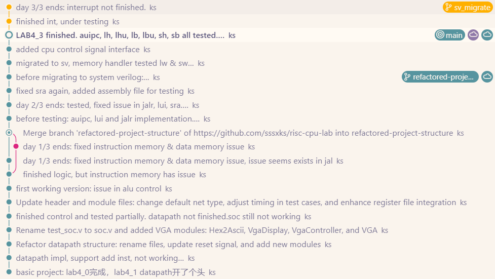

然后大概回忆一下遇到的一些问题吧

- 首先是发现无法导入使用`.edf`文件，就是下面这些文件，这个问题卡了我好几天
  - 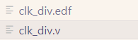
  - 然后助教告诉我不需要使用Lab2的soc，因为暂时不上板。不过即使这样我也不能在Lab4-1的时候使用参考的Control，~~所以被迫全自研~~
- 接下来两个问题都出在memory上
  - 首先是跳转的时候总是把跳转的后一条执行了，然后跳到目标地址的下一条开始执行。
          ...
        beq  x15, x20, test # jump to test
        addi x21, x20, 1    # 不执行, x21始终为0

        test: 
        lw  x22, 0x34(x0)     # x22 = 0x5555_5555 
        lw  x23, 0x48(x0)     # x23 = 0xAAAA_AAAA 
        ...

    - 类似上面这样的代码，`addi`指令总是被执行。然后第一个`lw`不执行。原因是instruction memory有一个额外的寄存器，导致一周期的延迟：
    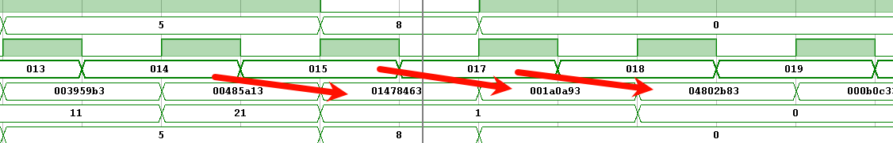
    如上图，总是在地址提供后的第二个posedge开始反应。检查发现是这个。
    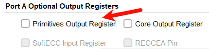
    取消勾选后就正常了。然后把Datamemory的这个选项也取消了下。
  - 接着是Datamemory读取的内存总是一下子就跑到`.coe`的文件的外面去了。检查发现datamemory是每32bit一个地址，而不是每字节一个地址。又有`lh`, `lhu`等指令的需求，就写了一个`mem_handler`模块，把这个问题完美解决了。（并不是截掉末尾两位强行align，那样只能保证`lw`, `sw`的逻辑）如图所示，下面的是地址，上面的是读出的数据。`0x34`已经超出`.coe`文件的范围了，因此得到`0x00000000`。
    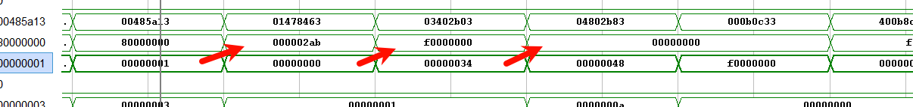
  - 接着还遇到一个相对比较小的问题。`sra`没有做sign extension，如图所示，错误的得到了`0x77778000`。
    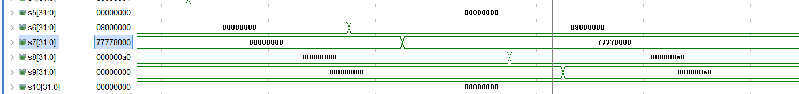
    正确写法见`my_ALU.sv`的`SRA`部分，也就是这样`$signed(A) >>> B`，要先做`$signed`转换才行。
  - 还有一个司空见惯的错误，经常遇到trailing comma，终于在vscode配置完linter后，再也没看到过类似的语法错误了。也不需要专门检查，好方便！

## 实验结果与分析

### 1. 1_datapath.S

测试如图
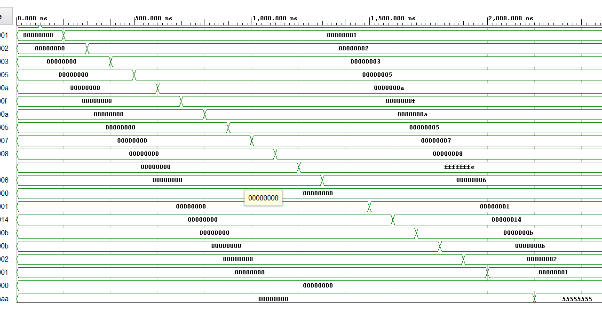
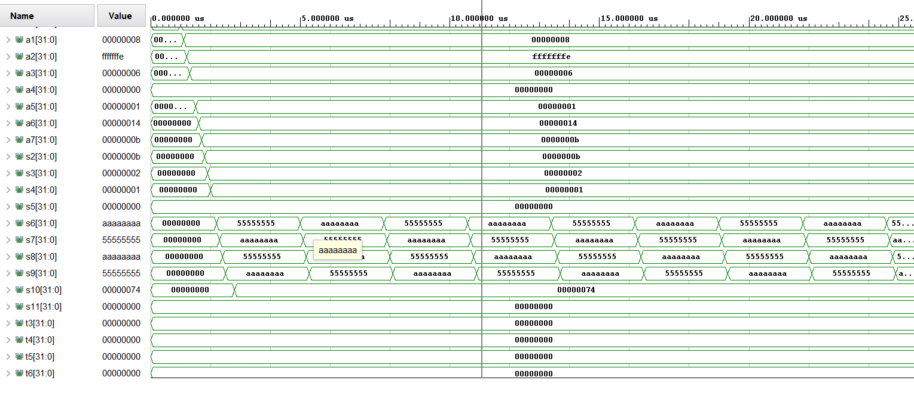

### 2. 2_more.S

测试如图
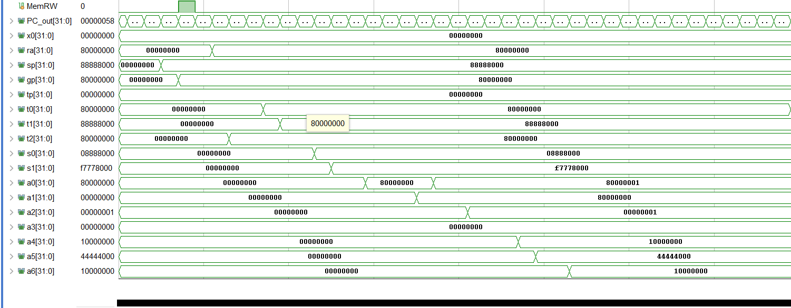
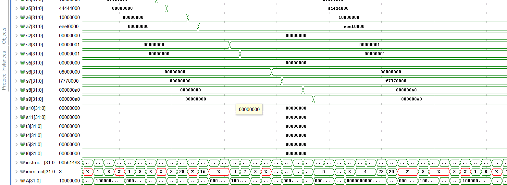

### 测试auipc, lui, lh, lhu, lb, lbu, sh, sb

这个测试是自己写的。汇编如下

```asm
.text
    .globl _start
_start:
    # Test JALR
    lui t0, 0x12345        # t0(x5) = 0x12345000
    addi t0, t0, 0x678     # t0(x5) = 0x12345678
    jalr ra, zero, 16      # x1(ra) = 0x0000000c PC = 16(after_jalr, 0x10)
    nop                    # This instruction should not execute if JALR works correctly

after_jalr:
    # Test AUIPC
    auipc t1, 0x12345      # x6(t1) = 0x12345010

    # Test LH (Load Halfword)
    li t0 0x12348678       # x5(t0) = 0x12348678
    # assemble to 123482b7        lui x5 0x12348
    #             67828293        addi x5 x5 1656
    sw t0, 0x100(zero)     # store 0x12348678
    lh t3, 0x100(zero)     # x28(t3) = 0xffff8678

    # Test LHU (Load Halfword Unsigned)
    lhu t4, 0x100(zero)     # x29(t4) = 0x00008678

    # Test LB (Load Byte)
    li t0 0x87
    sw t0 0x100(zero)
    lb t5, 0x100(zero)       # x30(t5) = 0xffffff87
    lbu t6, 0x100(zero)      # x30(t6) = 0x00000087
    
    # Test SH (Store Halfword)
    li t0, 0xABCD          # x5(t0) = 0xABCD
    # asseble to lui x5 0xb
    #            addi x5 x5 -1075
    sh t0, 0x102(x0)       # 0x100 = 0xabcd0087
    lw t0, 0x100(x0)       # x5(t0) = 0xabcd0087

    # Test SB (Store Byte)
    li t0, 0xEF            # x5(t0) = 0x000000ef
    sb t0, 0x103(x0) 
    lw t0, 0x100(x0)       # x5(t0) = 0xefcd0087

loop:
    jal loop
```

测试如图。结果是正确的
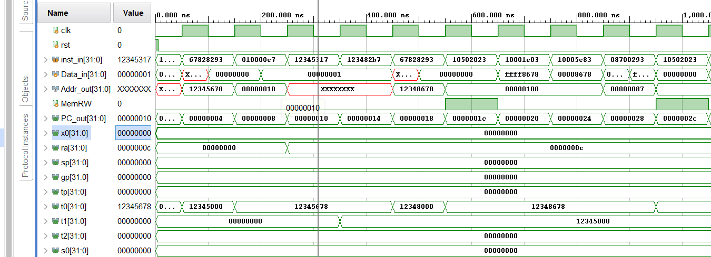

## 讨论、心得

中断截止写报告时间还没弄完，恳请助教见谅，验收的时候会有的。这个lab做的比较开心，也学到了很多。感谢助教的帮助。
